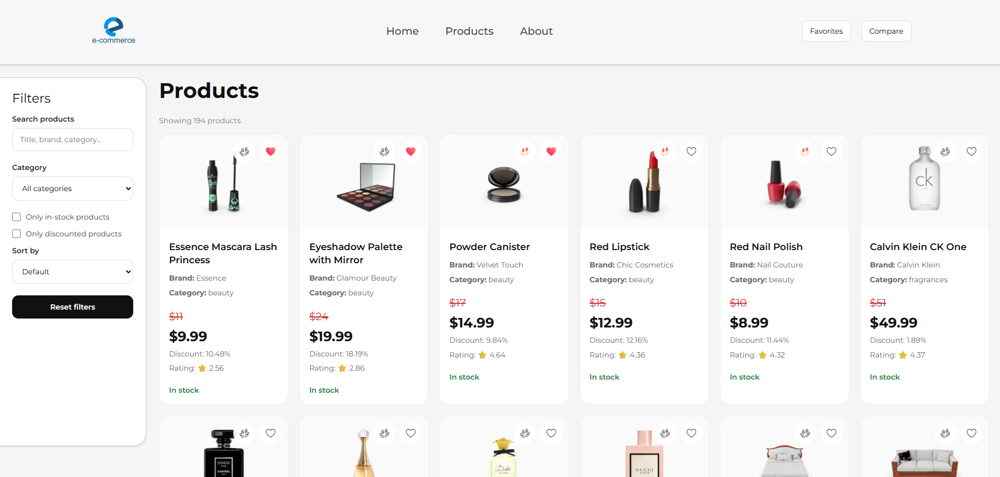
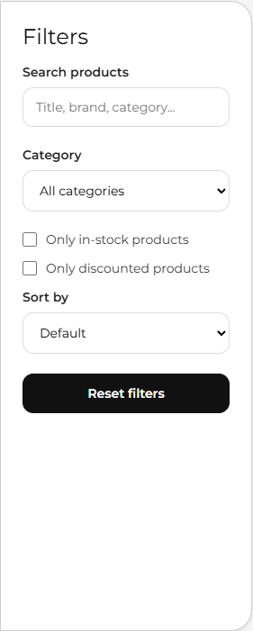
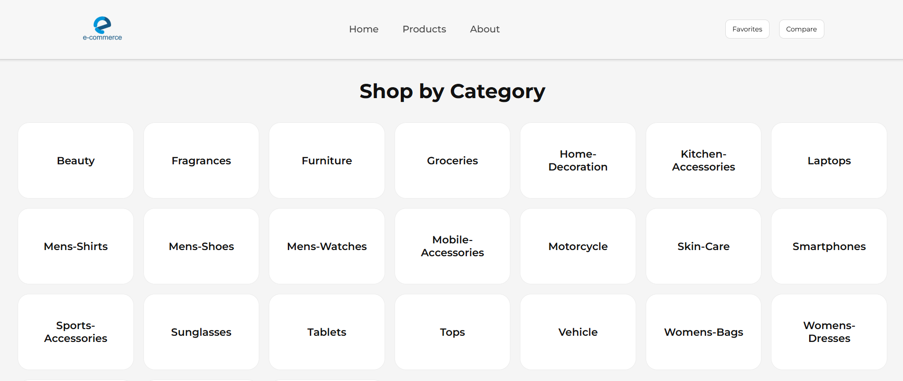
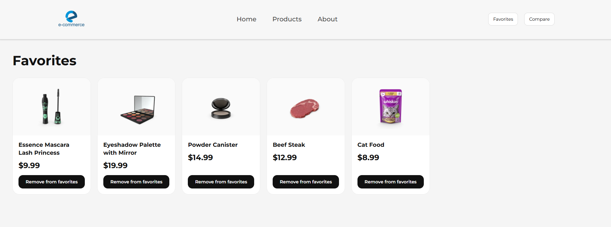
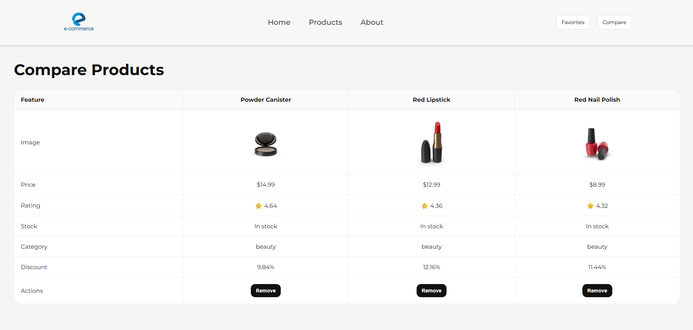

# Product Catalog App

A responsive product catalog web application built with React and TypeScript.

---

## Screenshots

### Products Page



### Filters Sidebar



### Categories Page



### Favorites Page



### Compare Page



---

## Features

- Fetch and display products from API
- Search products by:
  - title
  - brand
  - category
- Filter products by:
  - category
  - in-stock products
  - discounted products
- Sort products by:
  - price (low to high)
  - price (high to low)
  - rating
  - title (A-Z / Z-A)
- Favorites functionality:
  - add/remove favorites
  - persisted in localStorage
  - separate favorites page
- Compare functionality:
  - compare up to 3 products
  - comparison table
  - persisted in localStorage
- Loading, error, and empty states
- Responsive design
- Toast notifications
- Reset filters button
- Hover animations and transitions

---

## Tech Stack

- React
- TypeScript
- React Router
- CSS

---

## API

Products are fetched from:

```txt
https://dummyjson.com/products?limit=30
```

---

## Installation

```bash
npm install
```

---

## Run locally

```bash
npm run dev
```

---

## Build project

```bash
npm run build
```

---

## Project Structure

```txt
public/
screenshots/

src/
  components/
  hooks/
  pages/
  types/
  utils/
```

---

## Main Components

- ProductCard
- Header
- Footer
- Toast
- StatusMessage

---

## Custom Hooks

- useProducts

---

## Utilities

- getFilteredProducts

---

## What Was Implemented

- Product fetching from API
- Search functionality
- Product filters
- Product sorting
- Favorites system with localStorage
- Compare functionality with localStorage
- Responsive layout
- Toast notifications
- Empty, loading, and error states
- Reusable components
- Custom hooks and utility functions

---

## What Was Skipped

- Backend integration
- Authentication system
- Pagination
- Unit tests

---

## Known Issues

- Search from the header redirects only after form submit
- Compare table may require horizontal scrolling on very small screens
- Product images have different aspect ratios because of API data

---

## What I Would Improve With More Time

- Add unit and integration tests
- Improve mobile responsiveness
- Add animations with Framer Motion
- Add pagination or infinite scroll
- Add product details page
- Improve accessibility
- Optimize performance with memoization

---

## Author

AndrewBaganich